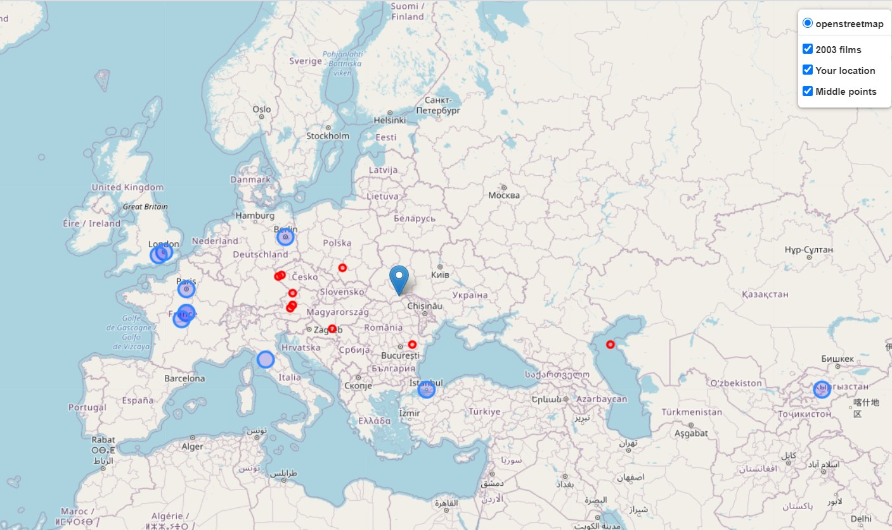

This project contains one module, called main.py. The main aim of it- to create map with ten nearest to user film-locations of given year. So generated map will contain user location, ten nearest films-locations and middle points between user and film.

There are also lots of functions in it, more about them you can find in documantation.

So, when user runs the program, he or she has ability to choose year, his or her location, starter number of film, from wich analysing will start and number of films (of given by user year) that will be analysed in total. Here is an example.

>>> python main.py
Please enter a year you would like to have a map for: 2003
Please enter your location (format: lat, long): 48.3, 25.934
Enter starter number of film from which you want to start analyse: 1
Enter number of films from given list, which you want to analyse (note, that for 3000 number it'll take 3-4 minutes, for 10 000 - 10-12 minutes and etc.): 200
Map is generating...
Collecting locations started
0% complete
10% complete
20% complete
30% complete
40% complete
50% complete
60% complete
70% complete
80% complete
90% complete
100% complete
Map is ready! Open Film_map.html and have fun)

This example will give next map (located in Film_map.html):

html file structure is next:
    - header with a standart folium style
    - body with one div, that creates map
    - footer with all needed js scripts